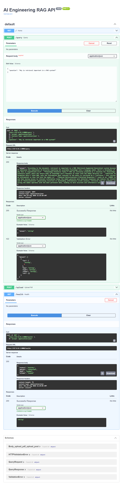
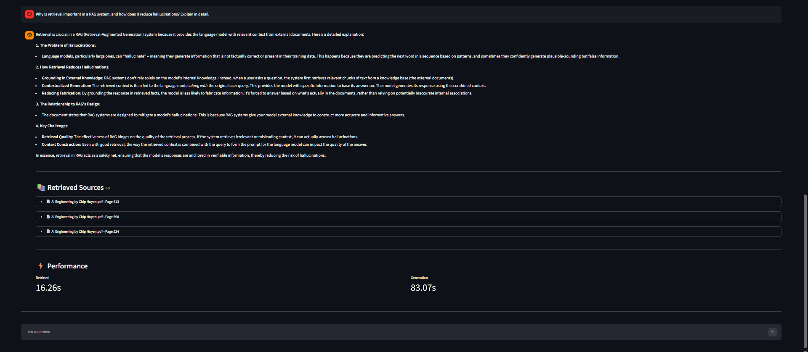
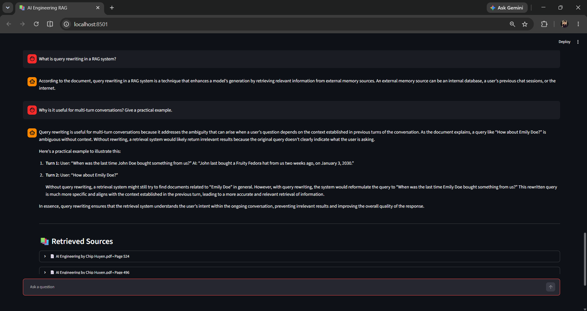

# Production-Style RAG System

A production-style Retrieval-Augmented Generation (RAG) application that lets users upload PDF documents and ask questions about their content.

The project started as a basic RAG pipeline and was progressively improved with query routing, conversation memory, history-aware retrieval, hybrid search, cross-encoder reranking, streaming responses, structured APIs, logging, health checks, and Docker support.

The main goal of this project was to understand how a RAG system can be designed beyond a simple "retrieve → generate" pipeline.

## Key Features

- PDF document upload and ingestion
- Document chunking and embedding generation
- Qdrant vector database for semantic retrieval
- BM25 keyword-based retrieval
- Hybrid search combining dense and sparse retrieval
- Cross-encoder reranking
- Query-aware retrieval strategies
- History-aware query rewriting for follow-up questions
- Conversation memory
- Streaming LLM responses
- Source-aware responses
- Retrieval and generation performance logging
- FastAPI backend
- Health check endpoint
- Docker and Docker Compose support
- Local LLM inference using Ollama
## 📸 Application Screenshots

### 1. FastAPI Swagger API

Interactive API documentation showing the available RAG endpoints including PDF upload, querying, and health checks.



### 2. RAG Response with Sources

The RAG assistant retrieves relevant document chunks and generates a grounded response. Retrieval and generation performance metrics are also displayed.



### 3. Conversational RAG with Query Rewriting

The system uses conversation history to understand follow-up questions and retrieve relevant context before generating the response.



## Architecture

```text
                         User
                          |
                          v
                    FastAPI / UI
                          |
                          v
                  Query Processing
                          |
              +-----------+-----------+
              |                       |
              v                       v
        Query Rewriting         Query Router
              |                       |
              +-----------+-----------+
                          |
                          v
                   Hybrid Retrieval
                    /            \
                   /              \
                  v                v
          Vector Search          BM25
             (Qdrant)         (Keyword)
                  \                /
                   \              /
                    +------------+
                          |
                          v
                 Candidate Documents
                          |
                          v
                Cross-Encoder Reranker
                          |
                          v
                    Top Documents
                          |
                          v
                   Ollama / Gemma
                          |
                          v
                  Streaming Answer

```

## Retrieval Pipeline

The retrieval pipeline is designed as multiple stages rather than relying on a single similarity search.
```text
User Question
     |
     v
Conversation History
     |
     v
History-Aware Query Rewriting
     |
     v
Query Router
     |
     v
Dense + Sparse Retrieval
     |
     +----> Qdrant Vector Search
     |
     +----> BM25 Search
     |
     v
Candidate Merging
     |
     v
Cross-Encoder Reranking
     |
     v
Top-K Context
     |
     v
LLM Generation
```
This allows the system to improve retrieval quality before the LLM receives the context.

## Why Hybrid Search?

Vector search is useful for understanding semantic similarity, but keyword-based search can perform better for exact terms, names, technical keywords, and specific phrases.

The system therefore combines:

- Dense retrieval using embeddings and Qdrant
- Sparse retrieval using BM25

The candidates from both methods are merged before being passed to the reranker.

## Cross-Encoder Reranking

The initial retrieval stage returns a larger candidate set.

Instead of directly sending those documents to the LLM, a cross-encoder evaluates the relevance between:

```text
 Query <-> Retrieved Document
```

The highest scoring documents are then selected as the final context.

This reduces the chance of sending irrelevant retrieved chunks to the LLM.

## History-Aware Retrieval

The system supports multi-turn conversations.

For example:

```text
User: What is Python?

User: What are its main features?
```
Instead of retrieving documents using only:
```text
What are its main features?
```

the system rewrites the question into a standalone query such as:
```text
What are the main features of Python?
```
This allows the retriever to understand follow-up questions more reliably.

## Query-Aware Retrieval

The retrieval configuration can be adapted according to the type of question.

For example:

```text
Factual question
        |
        v
Smaller retrieval context

Comparison question
        |
        v
Larger retrieval context

Summary question
        |
        v
Broader retrieval context
```

This makes the retrieval stage more flexible than using the same configuration for every query.

## Tech Stack

| Component | Technology |
|---|---|
| Language | Python |
| Backend | FastAPI |
| UI | Streamlit |
| LLM Framework | LangChain |
| LLM | Ollama / Gemma 3 4B |
| Embeddings | Sentence Transformers |
| Vector Database | Qdrant |
| Sparse Retrieval | BM25 |
| Reranking | Cross-Encoder |
| Containerization | Docker |
| Evaluation | DeepEval |
## Project Structure

```text
rag-system/
│
├── app/
│   ├── __init__.py
│   ├── api.py
│   ├── chunking.py
│   ├── config.py
│   ├── embeddings.py
│   ├── ingestion.py
│   ├── llm.py
│   ├── logger.py
│   ├── main.py
│   ├── pipeline.py
│   ├── rag.py
│   ├── retrieval.py
│   ├── streamlit_app.py
│   ├── upload.py
│   │
│   ├── exceptions/
│   │   └── handlers.py
│   │
│   ├── models/
│   │   └── schemas.py
│   │
│   └── services/
│       ├── bm25_service.py
│       ├── generation_service.py
│       ├── health_service.py
│       ├── history_service.py
│       ├── hybrid_service.py
│       ├── memory_service.py
│       ├── query_router.py
│       ├── rag_service.py
│       ├── reranker_service.py
│       └── retrieval_service.py
│
├── Dockerfile
├── docker-compose.yml
├── requirements.txt
├── .dockerignore
├── .gitignore
└── README.md
```

The code is separated into services so that ingestion, retrieval, reranking, generation, memory, and health checks can be developed independently.

## Running Locally

### 1. Clone the repository

```bash
git clone https://github.com/KunduruPavankumarreddy/ai-engineering-rag.git
cd ai-engineering-rag
```

### 2. Create a virtual environment

```bash
python -m venv .venv
```

Activate it on Windows:

```powershell
.venv\Scripts\activate
```

### 3. Install dependencies

```bash
pip install -r requirements.txt
```

### 4. Start Ollama

Install Ollama and make sure it is running.

Pull the required model:

```bash
ollama pull gemma3:4b
```

### 5. Start Qdrant

If using the Docker setup:

```bash
docker compose up -d qdrant
```

### 6. Start the FastAPI application

```bash
uvicorn app.main:app --reload
```

### 7. Start the Streamlit interface

Open another terminal, activate the virtual environment, and run:

```powershell
streamlit run app/streamlit_app.py
```

## Docker

The project also includes Docker configuration for running the application with containerized services.

Build and start the services:
```text
docker compose up --build
```
Stop the services:

```text
docker compose down
```

## API
### Health Check
```text
GET /health
```
Used to verify that the application is running correctly.

## Upload Document
```text
POST /upload
```
Uploads a PDF and sends it through the ingestion pipeline.

```text
PDF
 ↓
Text Extraction
 ↓
Chunking
 ↓
Embedding
 ↓
Qdrant
 ↓
BM25 Index
```

## Query
```text
POST /query
```

Processes a user question through the retrieval and generation pipeline.
```text
Question
 ↓
Query Rewriting
 ↓
Query Routing
 ↓
Hybrid Retrieval
 ↓
Reranking
 ↓
LLM
 ↓
Response
```

## Performance

The application logs the major stages of the RAG pipeline, including:

- Query processing time
- Embedding model loading time
- Vector retrieval time
- BM25 retrieval time
- Hybrid retrieval time
- Cross-encoder reranking time
- Retrieval time
- Time to first token
- LLM generation time

This makes it possible to identify bottlenecks instead of treating the RAG system as a black box.

## Development History

The project was built incrementally.

### v1.1 — Streaming Multi-PDF RAG
- Multi-PDF support
- Streaming responses
- MMR retrieval
- Modular service architecture
- Performance metrics
### v1.2 — Query-Aware Retrieval
- Query routing
- Dynamic retrieval configuration
- Different retrieval strategies for different question types
### v1.3 — Conversation Memory
- Multi-turn conversations
- Conversation history
- Follow-up questions
- Clear conversation functionality
### v1.4 — History-Aware Retrieval
- History-aware query rewriting
- Standalone query generation
- Improved retrieval for follow-up questions
### v1.5 — Hybrid Search & Reranking
- BM25 retrieval
- Dense + sparse hybrid search
- Candidate merging
- Cross-encoder reranking
### v1.5+ — Engineering Improvements
- FastAPI backend
- Structured request/response models
- Centralized logging
- Exception handling
- Health checks
- Docker support
- Docker Compose configuration
- Improved project structure

## What I Learned

Building this project helped me understand that a useful RAG application involves much more than connecting an LLM to a vector database.

Some of the main engineering problems explored in this project were:

- How to improve retrieval quality
- When vector search is not enough
- Combining semantic and keyword retrieval
- Why reranking is useful
- Handling conversational follow-up questions
- Designing modular RAG services
- Measuring retrieval and generation latency
- Structuring a FastAPI-based AI application
- Containerizing AI services with Docker
- Evaluating RAG responses

## Future Improvements
- Authentication and authorization
- Redis caching
- Better observability
- Automated CI/CD
- Cloud deployment
- Multi-user conversation storage
- More comprehensive RAG evaluation
- Retrieval and generation tracing

## Author

### Pavan Kunduru

AI Engineer | Machine Learning | Generative AI | LLM Engineering

## GitHub

🔗 [GitHub Repository](https://github.com/KunduruPavankumarreddy/ai-engineering-rag)